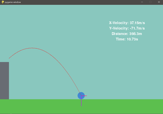

# Physics-Simulator
#### Simulations for University Physics 1 concepts, made with Python

### 1) Projectile Motion
User Inputs:
  1) Angle (at which they wish to project the ball/projectile
  2) Initial Velocity
  3) Height
 
 Output:
 - A pygame-made simulation which displays a circular projectile traveling through a calculated arc-shaped path until it hits the "ground".

 
